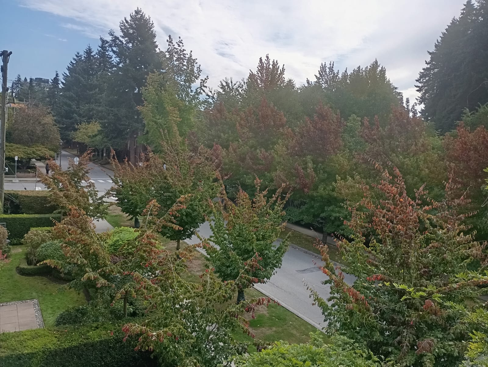

Starting the Master of Data Science program at UBC has been a major change for me. A few weeks ago, I was still in India preparing for my move to Vancouver, and now I am attending classes at one of Canada's largest universities. Arriving in Vancouver and seeing the UBC campus in person made the transition feel much more real. Orientation was a great opportunity to meet my classmates, learn more about the program, and get a better idea of what the next several months will look like.

The first couple of weeks have been a combination of excitement and adjustment. The program moves quickly, and there is a lot to learn across programming, computing platforms, data manipulation, and statistics. Coming from a software engineering background, some of the programming concepts feel familiar, but working with R and approaching problems from a statistical perspective has been a different experience for me. One of the biggest surprises has been how quickly we move from introducing a concept to actually applying it in labs and assignments.

After two weeks, I am still figuring out how to manage the pace, but I am enjoying the experience. There is definitely a lot to keep up with, but being surrounded by classmates with different academic and professional backgrounds makes the experience interesting. I know the coming months will be challenging, but I am looking forward to seeing how much I can learn and how my software engineering background can complement the data science skills I develop at UBC.
